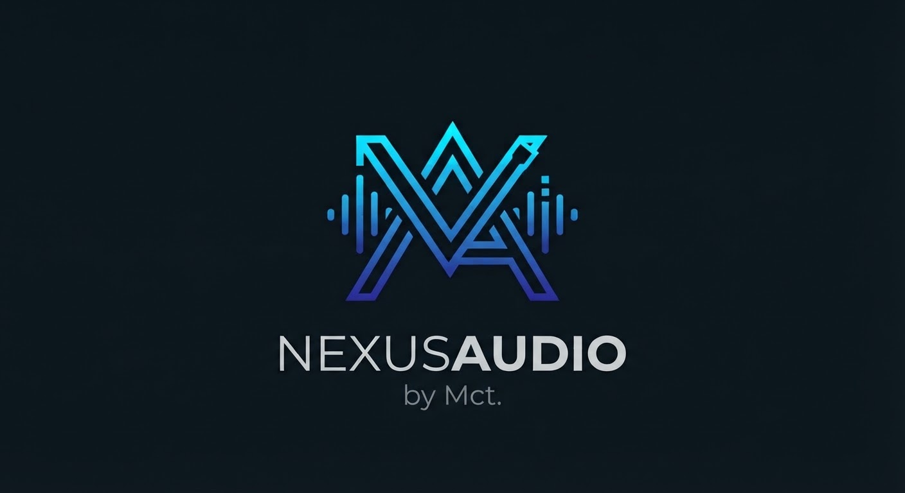

# Nexus Audio

<p align="center">
  
</p>

**Nexus Audio by Mct.** est une passerelle audio réseau pour Home Assistant OS. Elle rassemble plusieurs types d'entrées audio et les transforme en **Live Inputs Sendspin** utilisables dans **Music Assistant**.

> Version actuelle : **1.0.0-rc3** — candidate de validation terrain. Les moteurs sont intégrés, mais la chaîne Dante/PTP et les appareils réels doivent encore être validés sur l'installation cible avant de qualifier cette version de stable.


## Installation / Installation

**FR :** Dans Home Assistant, ouvrez la boutique des modules complémentaires/apps, puis **Dépôts**, et ajoutez `https://github.com/ycvgcz6jc6-dev/Nexus-audio`. Installez **Nexus Audio**, configurez vos sources dans les options du module et démarrez-le. Ouvrez ensuite son interface Ingress. Statime reste un service externe à installer/configurer pour Dante natif. Cette RC nécessite une validation audio sur votre matériel.

**EN:** In Home Assistant, open the add-on/app store, select **Repositories**, and add `https://github.com/ycvgcz6jc6-dev/Nexus-audio`. Install **Nexus Audio**, configure sources in the add-on options and start it. Then open its Ingress interface. Native Dante requires a separately installed/configured Statime service. This RC still needs audio acceptance testing on your hardware.

**FR :** Le port de gestion 8099 écoute sur le réseau local, sans authentification propre. Réservez son accès à un réseau de confiance ; ne l'exposez pas à Internet.

**EN:** Management port 8099 listens on the local network without its own authentication. Restrict access to a trusted network; do not expose it to the Internet.

## 🇫🇷 Français

### À quoi sert Nexus Audio ?

Nexus Audio permet de faire entrer dans Music Assistant des sources qui ne sont normalement pas des lecteurs Music Assistant :

| Entrée | Moteur | Utilisation |
|---|---|---|
| **AirPlay** | Shairport Sync | Recevoir l'audio d'un iPhone, iPad ou Mac |
| **Spotify Connect** | librespot | Faire apparaître Nexus Audio comme appareil Spotify Connect |
| **Dante RX** | Inferno / inferno2pipe | Recevoir des canaux Dante depuis une console, un boîtier ou un autre émetteur Dante |
| **AES67 RX** | SAP/SDP + RTP | Découvrir et recevoir un flux AES67 multicast |

Le chemin principal est :

```text
AirPlay / Spotify Connect / Dante / AES67
                    │
                    ▼
               Nexus Audio
                    │ PCM
                    ▼
          Sendspin Source (source@v1)
                    │
                    ▼
             Music Assistant
                    │
        ┌───────────┴───────────┐
        ▼                       ▼
 lecteurs / zones MA       Spin2Dante
                                │
                                ▼
                              Dante
```

Nexus Audio **ne remplace pas Music Assistant** : Music Assistant reste responsable des zones, groupes, volumes et de la distribution. Nexus Audio s'occupe des **entrées**.

### Menu Nexus Audio

Le panneau Ingress Home Assistant est organisé en quatre vues :

- **Vue d'ensemble** : état global, Music Assistant, PTP/Statime, interfaces réseau et résumé des sources.
- **Sources** : état de chaque entrée, présence audio, niveau, NIC/IP, Sendspin, appairage et commandes Start / Stop / Restart.
- **AES67** : sessions SAP/SDP découvertes sur les interfaces configurées et paramètres RTP annoncés.
- **Aide** : explications intégrées en français ou en anglais, sans devoir ouvrir ce README.

Le bouton **FR / EN** change la langue de l'interface et est mémorisé dans le navigateur.

### Music Assistant / Sendspin

Chaque source possède sa propre identité Sendspin. Lors de la première connexion, Music Assistant peut demander l'appairage de la source. Le panneau Nexus Audio affiche l'état de connexion et, lorsque nécessaire, le token d'appairage.

Configuration par défaut :

```yaml
music_assistant:
  host: "127.0.0.1"
  port: 8927
```

### Dante RX natif

Le moteur Dante repose sur **Inferno**, de la même famille que celle utilisée par Spin2Dante. Chaque source Dante RX dispose de son nom, de son interface réseau, de son `process_id`, de son `alt_port` et de sa latence RX.

Statime doit fournir l'horloge PTP via :

```text
/share/usrvclock
```

Exemple :

```yaml
- id: shure_rx
  type: dante_rx
  dante_mode: native_dante
  name: "Shure Dante 1-2"
  interface: enp10s0
  enabled: true
  channels: 2
  sample_rate: 48000
  process_id: 1
  alt_port: 14000
  rx_latency_ms: 10
  auto_restart: true
```

Les `process_id` doivent être uniques. Les `alt_port` de deux récepteurs natifs doivent être espacés d'au moins 10 ports. Le routage des canaux vers Nexus Audio se fait ensuite dans Dante Controller.

### AES67

AES67 reste volontairement séparé du moteur Dante natif. Nexus Audio écoute les annonces **SAP/SDP** sur la carte réseau sélectionnée, affiche les sessions découvertes et reçoit le flux RTP multicast configuré. Les codecs actuellement prévus sont **L16** et **L24**.

### AirPlay

AirPlay utilise le paquet Shairport Sync d’Alpine (AirPlay 1) : son PCM stéréo 44,1 kHz / 16 bits est rééchantillonné vers 48 kHz avant Sendspin. AirPlay 2 n’est pas fourni par ce paquet. AirPlay 2 et son horloge NQPTP doivent être isolés correctement du réseau Dante/PTP. Éviter de placer AirPlay 2 et Dante sur la même interface si leurs services PTP entrent en conflit.

### Spotify Connect

Une source `spotify` lance librespot en mode Spotify Connect. Elle apparaît dans l'application Spotify sous le nom choisi dans Nexus Audio. Aucun mot de passe Spotify n'est stocké dans la configuration Nexus Audio ; l'identité/cache librespot est conservé sous `/data/runtime/<source-id>/librespot-cache`.

Chemin audio :

```text
Spotify → librespot → PCM S16 / 44,1 kHz → rééchantillonnage 48 kHz → Sendspin → Music Assistant
```

librespot nécessite un compte Spotify compatible avec son fonctionnement Spotify Connect.

### Surveillance et sécurité de fonctionnement

Nexus Audio expose pour chaque source : état du worker, PID, uptime, redémarrages, présence audio, dernier audio reçu, niveau crête dBFS, NIC/IP, état Sendspin, état PTP/Dante ou RTP/AES67 et derniers logs. Le watchdog peut redémarrer automatiquement un worker défaillant lorsque `auto_restart` est activé.

La configuration enregistrée depuis Nexus Audio est persistée dans `/data/gateway_config.json`. Les options Supervisor restent le bootstrap/fallback.

### Google Cast

Le chemin Cast expérimental historique est conservé dans le code pour compatibilité, mais **n'est pas activé dans cette version**. Il n'est pas présenté comme une entrée fonctionnelle de Nexus Audio.

---

## 🇬🇧 English

### What is Nexus Audio?

**Nexus Audio by Mct.** is a network-audio input gateway for Home Assistant OS. It receives **AirPlay, Spotify Connect, native Dante RX and AES67**, converts those inputs to PCM and exposes them as **Sendspin Live Inputs** to Music Assistant.

Music Assistant remains responsible for zones, grouping, volume and playback distribution. Nexus Audio focuses on bringing external audio **into** Music Assistant.

### Nexus Audio menu

The Home Assistant Ingress panel provides four views:

- **Overview** — global health, Music Assistant, Statime/PTP, network interfaces and source summary.
- **Sources** — per-input state, audio presence/level, NIC/IP, Sendspin pairing and Start / Stop / Restart controls.
- **AES67** — discovered SAP/SDP sessions and announced RTP parameters.
- **Help** — built-in explanations in French or English.

The **FR / EN** control changes the interface language and stores the preference in the browser.

### Audio engines

| Input | Engine | Purpose |
|---|---|---|
| **AirPlay** | Shairport Sync | Receive audio from Apple devices |
| **Spotify Connect** | librespot | Expose Nexus Audio as a Spotify Connect device |
| **Dante RX** | Inferno / inferno2pipe | Receive native Dante audio channels |
| **AES67 RX** | SAP/SDP + RTP | Discover and receive multicast AES67 streams |

### Dante and PTP

Native Dante RX uses Inferno and an external Statime clock. The default clock socket is `/share/usrvclock`. Every native receiver requires a unique `process_id`; `alt_port` base values must be at least 10 ports apart. Use the same Dante-facing interface for Inferno and Statime.

### Spotify Connect

Spotify Connect uses librespot's discovery mode and a raw PCM pipe. Nexus Audio does not store a Spotify password in its gateway configuration. The librespot cache/identity is kept in the source's private runtime directory.

### Monitoring

The panel reports worker/process health, uptime, restart counters, audio presence, peak dBFS, selected NIC/IP, Sendspin pairing, Dante/PTP or AES67/RTP status and recent worker logs. An optional watchdog restarts failed workers automatically.

### Experimental Cast path

The historical experimental Cast code path is retained for compatibility, but it is **not enabled or advertised as a working Nexus Audio input** in this release candidate.

---

## Data and paths

```text
/data/gateway_config.json       Persistent Nexus Audio configuration
/data/runtime/<source-id>/      Per-source runtime state
/share/usrvclock                Default Statime / PTP clock socket
```

## Release status

**1.0.0-rc3** freezes the feature set around AirPlay, Spotify Connect, Dante RX and AES67. The remaining step before a stable `1.0.0` is real-hardware acceptance testing on the target Home Assistant OS / Music Assistant / Dante network.

---

**Nexus Audio — by Mct.**

## Diagnostic / Troubleshooting (RC2)

Nexus Audio écrit un journal rotatif dans `/data/logs/nexus-audio.log` (5 MiB par fichier, 5 archives). Les événements de démarrage/arrêt, workers audio, processus externes, interfaces, erreurs et redémarrages watchdog sont horodatés. Les secrets (mots de passe, tokens, PSK, clés privées et identifiants d'authentification) sont expurgés du paquet de diagnostic.

L'API `/api/diagnostics` génère un ZIP contenant les journaux, la configuration expurgée, les interfaces, l'état des sources, les sessions SAP/AES67 et les métriques système. `/health` expose aussi charge système et mémoire. Pour Dante, les diagnostics incluent l'état du socket Statime `/share/usrvclock` et son âge de modification comme indicateur technique ; cet âge ne doit pas être interprété à lui seul comme une mesure de dérive PTP.

Les annonces SAP non rafraîchies sont retirées après 30 secondes et les fichiers SDP temporaires AES67 sont supprimés à l'arrêt du récepteur.

### English — diagnostics

Nexus Audio writes rotating logs to `/data/logs/nexus-audio.log` (5 MiB each, 5 backups). `/api/diagnostics` produces a ZIP with logs, redacted configuration, interfaces, source state, SAP/AES67 discovery and system metrics. Passwords, tokens, PSKs, private keys and authentication credentials are redacted. Stale SAP sessions expire after 30 seconds and temporary AES67 SDP files are removed when a receiver stops.


## RC3 — Music Assistant Live Input normalization
Spotify Connect is decoded by librespot at 44.1 kHz S16 stereo and explicitly resampled by Nexus Audio to 48 kHz S16 stereo before Sendspin. Diagnostics expose both input and Sendspin output formats.

## RC3 — Normalisation Live Input Music Assistant
Spotify Connect est décodé par librespot en 44,1 kHz S16 stéréo puis rééchantillonné explicitement par Nexus Audio en 48 kHz S16 stéréo avant Sendspin. Les diagnostics affichent le format entrant et le format envoyé à Music Assistant.

## License / Licence

© 2026 Cyprien De Waele — Nexus Audio / Mct.

Nexus Audio original code: Apache License 2.0. See [LICENSE](LICENSE), [NOTICE](NOTICE) and [third-party notices](THIRD_PARTY_NOTICES.md). Third-party engines retain their own licenses.
